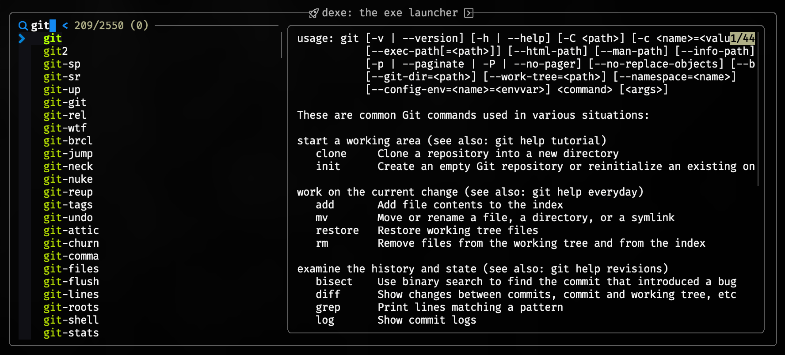

<div align = "center">

<h1><a href="https://github.com/2kabhishek/dexe">dexe</a></h1>

<a href="https://github.com/2KAbhishek/dexe/blob/main/LICENSE">
 </a>

<a href="https://github.com/2KAbhishek/dexe/graphs/contributors">
 </a>

<a href="https://github.com/2KAbhishek/dexe/stargazers">
</a>

<a href="https://github.com/2KAbhishek/dexe/network/members">
 </a>

<a href="https://github.com/2KAbhishek/dexe/watchers">
 </a>

<a href="https://github.com/2KAbhishek/dexe/pulse">
 </a>

<h3>The exe launcher 🐚🚀</h3>

<figure>
  
  <br/>
  <figcaption>dexe in action</figcaption>
</figure>

</div>

dexe, pronounced `the E X E or dexy` is a nix CLI launcher that helps you run any executable, alias, and function on your system.

## ✨ Features

- List all executables in yqur PATH
- List all aliases and functions defined in your shell
- Powerful fuzzy finding with fzf
- Glance over help info for any available executable
- Easily integrates with neovim, shell, tmux and other tools

## ⚡ Setup

### ⚙️ Requirements

- bash, fzf

### 💻 Installation

```bash
git clone https://github.com/2kabhishek/dexe
cd dexe
# Link dexe to a directory that's in PATH (~/.local/bin here)
ln -sfnv "$PWD/dexe.sh" ~/.local/bin/dexe
```

## 🚀 Usage

```bash
dexe: Execute and Launch CLI Tools 🚀✨

Usage: dexe [optional pass-through args]

dexe --wait-before-exit -- Wait for input before exiting
dexe -h, --help -- Display this help menu

dexe README.md -- Run selected command with README.md
dexe --verbose -- Run selected command with --verbose flag
```

Use the `--wait-before-exit` flag when you want to "hold" the session even after the command completes, useful in situations where the shell exits after command finishes.

### Integrations

- neovim:

I use `dexe` mapped to <key>Leader</key> <key>t d</key> in my [neovim which-key config](https://github.com/2kabhishek/nvim2k/blob/main/lua/plugins/tools/which-key.lua) with [termim.nvim](https://github.com/2kabhishek/termim.nvim)

You can add it using this in your which-key config:

```lua
    t = {
        name = 'Terminal',
        d = { '<cmd>Sterm dexe<cr>', 'Exe Launcher' },
        w = { '<cmd>Sterm dexe --wait-before-exit<cr>', 'Exe Launcher, Wait' },
    },
```

- tmux:

`dexe` is mapped to <kbd>Alt</kbd> + <kbd>d</kbd> using [tmux-tilit](https://github.com/2kabhishek/tmux-tilit)

You can add it using this in your `tmux.conf`:

```bash
bind-key -n M-d run-shell "dexe"
```

- zsh:

`dexe` is mapped to <kbd>Ctrl</kbd> + <kbd>d</kbd> in my [zsh config](https://github.com/2KAbhishek/dots2k/blob/main/config/zsh/keys.zsh)

You can add it using this in your `.zshrc`

```bash
bindkey -s "^d" ' dexe^M ^M'
```

## 🏗️ What's Next

You tell me!

## 🧑‍💻 Behind The Code

### 🌈 Inspiration

Needed a quick way to run tools that runs both on macOS and Linux.

### 💡 Challenges/Learnings

- Writing pipes to parse all of the executables in PATH
- Figuring out that configured aliases and functions only show up in interactive mode

### 🧰 Tooling

- [dots2k](https://github.com/2kabhishek/dots2k) — Dev Environment
- [nvim2k](https://github.com/2kabhishek/nvim2k) — Personalized Editor
- [sway2k](https://github.com/2kabhishek/sway2k) — Desktop Environment
- [qute2k](https://github.com/2kabhishek/qute2k) — Personalized Browser

### 🔍 More Info

- [bare-minimum](https://github.com/2kabhishek/bare-minimum) — General purpose template
- [tiny-web](https://github.com/2kabhishek/tiny-web) — Web app template

<hr>

<div align="center">

<strong>⭐ hit the star button if you found this useful ⭐</strong><br>

<a href="https://github.com/2KAbhishek/dexe">Source</a>
| <a href="https://2kabhishek.github.io/blog" target="_blank">Blog </a>
| <a href="https://twitter.com/2kabhishek" target="_blank">Twitter </a>
| <a href="https://linkedin.com/in/2kabhishek" target="_blank">LinkedIn </a>
| <a href="https://2kabhishek.github.io/links" target="_blank">More Links </a>
| <a href="https://2kabhishek.github.io/projects" target="_blank">Other Projects </a>

</div>
